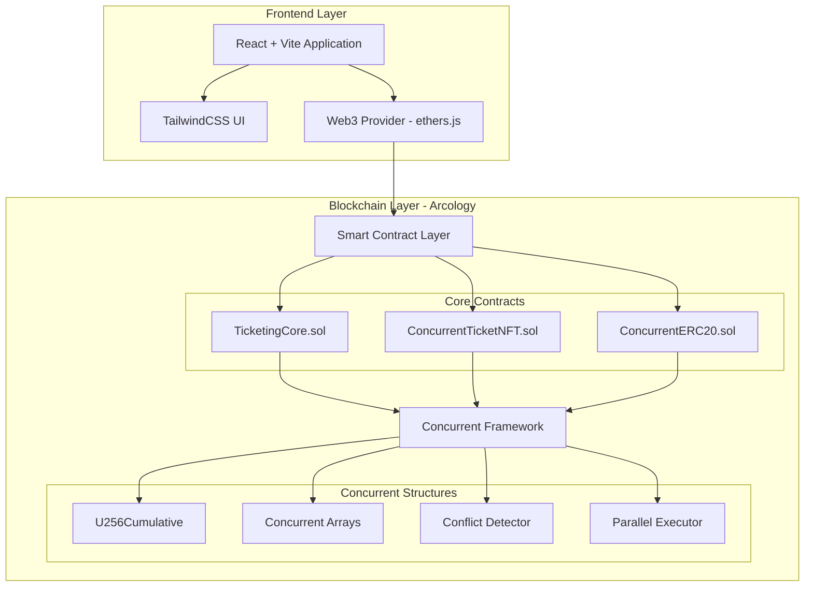

## Blockchain-Based Parallel Ticketing System on Arcology

## 1. Executive Summary

### 1.1 Problem Statement

Current ticketing platforms suffer from catastrophic failures during high-demand events, with systems like TicketOn (Kazakhstan) and Ticketmaster (globally) crashing when processing just 25,000-3.5 billion requests. These failures result in:

- 4+ hour outages during critical sale periods
- Duplicate ticket sales and payment errors
- "Charged but no ticket received" scenarios
- Zero accountability for platform failures

### 1.2 Solution Overview

A blockchain-based ticketing platform leveraging Arcology's parallel execution capabilities to achieve:

- 100+ TPS on development hardware, 10,000+ TPS on production hardware
- Atomic payment and ticket delivery (impossible to have payment without ticket)
- Zero possibility of duplicate sales through NFT uniqueness
- Deterministic, mathematically certain operation under any load

### 1.3 Technology Stack

- **Project Structure:** npm workspaces monorepo (hardhat + frontend)
- **Blockchain:** Arcology Network (EVM-compatible with parallel execution)
- **Smart Contracts:** Solidity 0.8.20+ with Arcology Concurrent Library
- **Development Framework:** Hardhat v3 with Ignition deployment system
- **Frontend:** Vite + React + TailwindCSS
- **Web3 Integration:** ethers.js v6 (direct wallet connection via BrowserProvider)
- **Routing:** React Router v6
- **Token Standards:** Custom ERC-721 and ERC-20 implementations with Arcology concurrent structures
- **Build System:** Automatic ABI export and contract packaging for frontend consumption

## 2. System Architecture

### 2.1 High-Level Architecture



### 2.2 Smart Contract Architecture

#### 2.2.1 Core Contracts

1. **TicketingCore.sol**
   - Event management with fixed 3-tier structure
   - Parallel-safe ticket sales using U256Cumulative
   - Unlimited revenue withdrawals for organizers
   - Time-locked refund mechanism (12 hours before event)
2. **ConcurrentTicketNFT.sol** (Based on Arcology patterns)
   - Custom ERC-721 implementation with concurrent structures
   - Uses U256Cumulative for total supply tracking
   - Lazy minting on purchase
   - Burn capability for refunds
   - Parallel-safe transfer operations
3. **ConcurrentERC20.sol** (Following ds-token pattern from Arcology examples)
   - Custom ERC-20 implementation using Arcology's concurrent library
   - U256Cumulative for balance tracking
   - Parallel-safe transfers and approvals
   - Based on: https://github.com/arcology-network/examples/blob/main/ds-token/contracts/Token.sol

#### 2.2.2 Fixed Tier Structure

Each event has exactly 3 tiers with the following properties:

- **Tier 1:** Premium (capacity, price)
- **Tier 2:** Standard (capacity, price)
- **Tier 3:** General (capacity, price)

Each tier uses:

- U256Cumulative for sold count (0 to capacity bounds)
- Fixed price in ERC-20 tokens
- Capacity limit enforced by cumulative upper bound

### 2.3 Project Structure

```
Root/
├── package.json              # Workspace root configuration
├── hardhat/                  # Smart contracts workspace
│   ├── contracts/            # Solidity contracts
│   │   ├── TicketingCore.sol
│   │   ├── ConcurrentTicketNFT.sol
│   │   └── ConcurrentERC20.sol
│   ├── ignition/
│   │   ├── modules/          # Hardhat Ignition deployment modules
│   │   └── deployments/      # Deployment artifacts
│   ├── abi/                  # Auto-generated ABIs (exported on compile)
│   ├── hardhat.config.js     # Network configs, Arcology RPC
│   └── package.json          # Exports as npm package for frontend
│
└── frontend/                 # React frontend workspace
    ├── src/
    │   ├── components/       # React components
    │   │   ├── Navigation.jsx
    │   │   ├── EventCreator/
    │   │   ├── EventBrowser/
    │   │   ├── PurchaseFlow/
    │   │   ├── RefundManager/
    │   │   └── Dashboard/
    │   ├── pages/            # Route-based page components
    │   │   ├── Home.jsx
    │   │   ├── CreateEvent.jsx
    │   │   ├── EventDetails.jsx
    │   │   ├── MyTickets.jsx
    │   │   └── OrganizerDashboard.jsx
    │   ├── lib/              # Core utilities
    │   │   ├── contracts.js  # Contract loading by chainId
    │   │   └── web3.js       # ethers.js BrowserProvider setup
    │   ├── hooks/            # React hooks
    │   │   ├── useContract.js
    │   │   ├── useWallet.js
    │   │   └── useRealtime.js
    │   ├── utils/            # Helper functions
    │   │   ├── constants.js
    │   │   ├── formatters.js
    │   │   └── errorHandler.js
    │   └── styles/           # CSS modules
    ├── vite.config.js
    └── package.json
```

## 3. Detailed Functional Requirements

### 3.1 Event Organizer Features

#### 3.1.1 Event Creation

- **Input Parameters:**
  - Event name, venue, timestamp
  - Fixed 3 tiers with:
    - Tier 1: Capacity (uint256), price (uint256)
    - Tier 2: Capacity (uint256), price (uint256)
    - Tier 3: Capacity (uint256), price (uint256)
  - Payment token address (standard ERC-20)
- **Constraints:**
  - Event must be >12 hours in future
  - Tier capacities must be > 0
- **Output:**
  - Event ID for reference
  - Deployed NFT contract address
  - Gas cost: ~3-4M gas for 3-tier deployment

#### 3.1.2 Revenue Withdrawal

- **Trigger:** Available anytime after refund deadline (event time - 12 hours)
- **Operations:**
  - Check timestamp > refund deadline
  - Deduct the available balance to a requester number of tokens to withdraw (overflow is enforced via cumulative lower bound set to 0)
  - Transfer requested amount of ERC-20 tokens to organizer
  - No limit on number of withdrawals
- **Security:** ReentrancyGuard pattern required

### 3.2 Fan Purchase Features

#### 3.2.1 Event Discovery

- **Real-time Display:**
  - Tier capacity
  - Sold tickets amount per tier (sold.get())
  - Tier ticket pricing
  - Time until event/refund deadline
- **Update Frequency:** Every block (~1 second on Arcology)

#### 3.2.2 Ticket Purchase Flow


- **Parallel Safety:**
  - Uses tier.sold.add(1) for conflict-free increment
  - Automatic revert if capacity exceeded (cumulative upper bound)
  - Atomic payment and NFT minting
- **Retry Logic:**
  - 3 automatic attempts on network failure
  - Exponential backoff: 1s, 2s, 4s

#### 3.2.3 Refund Mechanism

- **Eligibility:** timestamp < (eventTime - 12 hours)
- **Atomic Operations:**
  1. Verify NFT ownership
  2. Burn NFT token
  3. Decrement tier.sold using sub(1)
  4. Transfer ERC-20 payment back to user
- **Gas Cost:** ~100-150k gas

### 3.3 Load Testing & Simulation Features

#### 3.3.1 Aggressive Load Simulation

- **Test Parameters:**
  - 1000+ parallel purchase transactions every 10 seconds
  - Continue until 25,000 tickets sold
  - Random tier selection weighted by capacity
  - 10% random refunds from previous batch
- **Metrics Collection:**
  - Successful purchases per tier
  - Refund success rate
  - TPS achieved
  - Gas consumption per operation
  - Conflict detection rate

## 4. Technical Requirements

### 4.1 Performance Requirements

- **Development Hardware (Laptop):**
  - Target: 100+ TPS sustained
  - Transaction confirmation: <3 seconds
- **Production Hardware (Benchmarking):**
  - Target: 10,000-15,000 TPS
  - Transaction confirmation: <1 second
  - Support 100,000+ concurrent users

### 4.2 Security Requirements

1. **Smart Contract Security:**
   - No reentrancy vulnerabilities (ReentrancyGuard)
   - Integer overflow protection (Solidity 0.8+)
   - Time manipulation resistance (15-minute tolerance)
   - Access control on admin functions
2. **Atomic Guarantees:**
   - Payment ↔ Ticket delivery atomicity
   - No partial state updates
   - Deterministic conflict resolution via Arcology
3. **Frontend Security:**
   - Input validation before blockchain calls
   - Secure wallet connection handling
   - HTTPS only for production deployment

### 4.3 Gas Optimization Requirements

- **Deployment Costs:**
  - Main contract: <5M gas
  - NFT contract per event: <3M gas
- **Operation Costs:**
  - Purchase: <200k gas
  - Refund: <150k gas
  - Withdrawal: <50k gas per transaction
- **Optimization Techniques:**
  - Lazy minting for NFTs
  - Fixed 3-tier structure (no dynamic arrays)
  - Minimal storage writes using cumulative structures

---

## 5. Potential Pitfalls & Mitigation Strategies

### 5.1 Arcology-Specific Challenges

#### 5.1.1 Commutativity Violations

**Risk:** Mixing commutative and non-commutative operations causes conflicts  
**Example:** Reading `fullLength()` while others are pushing to array  
**Mitigation:**

- Strict separation of read and write operations
- Use `committedLength()` for safe reads during parallel execution
- Implement deferred patterns for aggregation operations
- Comprehensive testing of all conflict scenarios

#### 5.1.2 Custom Token Implementation Complexity

**Risk:** Implementing ERC-20/721 with concurrent structures introduces bugs

**Mitigation:**

- Follow Arcology's ds-token pattern exactly
- Use U256Cumulative for all balance/supply tracking
- Extensive unit testing of token operations
- Test parallel transfers and approvals thoroughly

#### 5.1.3 Fixed Tier Structure Limitations

**Risk:** 3-tier structure might not fit all event types

**Mitigation:**

- Allow flexible naming for each tier
- Support zero capacity for unused tiers
- Clear documentation on tier configuration
- Consider dynamic tiers in v2

### 5.2 Frontend Integration Challenges

#### 5.2.1 Web3 Provider Compatibility

**Risk:** Arcology RPC differences from standard Ethereum

**Mitigation:**

- Test with Arcology DevNet extensively
- Custom provider wrapper for Arcology-specific features
- Fallback RPC endpoints
- Clear error messages for incompatible operations

#### 5.2.2 Real-time State Synchronization

**Risk:** UI shows stale availability data during high load

**Mitigation:**

- Block event listeners for immediate updates
- Optimistic UI updates with rollback capability
- WebSocket connections for live data
- Polling fallback with exponential backoff

#### 5.2.3 Transaction Status During Load Tests

**Risk:** Users confused during 1000+ parallel transactions

**Mitigation:**

- Batch transaction status display
- Success/failure rate visualization
- Real-time TPS counter
- Clear pending/confirmed/failed states

---

## 6. Testing Strategy

### 6.1 Smart Contract Testing (Hardhat v3 + Solidity)

```solidity
contract LoadSimulator {
	using Multiprocess for Multiprocess;

	function simulateBatch(uint256 purchases, uint256 refunds) {
		Multiprocess mp = new Multiprocess(purchases + refunds);

		// Add purchase jobs
		for(uint i = 0; i < purchases; i++) {
			mp.addJob(gasLimit, 0, ticketingCore,
				abi.encodeWithSignature("purchaseTicket(uint256,string)",
				eventId, randomTier()));
		}

		// Add refund jobs (10% of previous batch)
		for(uint i = 0; i < refunds; i++) {
			mp.addJob(gasLimit, 0, ticketingCore,
				abi.encodeWithSignature("refundTicket(uint256)",
				previousBatchTokens[random() % previousBatchTokens.length]));
		}

		mp.run(); // Execute all jobs in parallel
	}
}
```

## 7. Implementation Priorities

### Phase 1: Core Smart Contracts (Week 1)

1. Implement ConcurrentERC20 following ds-token pattern
2. Implement ConcurrentTicketNFT with lazy minting
3. Develop TicketingCore with 3-tier structure
4. Write comprehensive Solidity tests

### Phase 2: Frontend Development (Week 2)

1. Web3 integration with ethers.js BrowserProvider
2. Build event creation interface
3. Develop purchase flow with tier selection
4. Implement dashboard and analytics views

### Phase 3: Integration & Load Testing (Week 3)

1. Deploy to Arcology DevNet
2. Implement load simulation contract
3. Run 100,000 ticket sale simulation
4. Optimize gas usage and parallel execution

---

## 8. Appendices

### A. Gas Estimation Calculations

```
Event Creation: 3M (base) + 1M (NFT contract)
Ticket Purchase: 150k (logic) + 50k (NFT mint)
Refund: 100k (logic) + 30k (NFT burn)
Withdrawal: 50k (ERC-20 transfer)
Load Simulation: 200k * transactions in batch
```

### B. Conflict Pattern Analysis

- **Safe Operations:**
  - Multiple purchases in different tiers
  - Multiple purchases in same tier (U256Cumulative handles)
  - Multiple refunds for different tickets
  - Multiple withdrawals by organizer
- **Conflict Scenarios:**
  - Reading fullLength() during concurrent pushes
  - Index-based access during modifications

### C. Dependencies

#### C1. Root Project Configuration

```json
{
  "name": "going-in",
  "private": true,
  "engines": {
    "node": ">=20"
  },
  "workspaces": ["frontend", "hardhat"]
}
```

#### C2. Hardhat Workspace Dependencies

```json
{
  "name": "going-in-contracts",
  "type": "module",
  "main": "index.js",
  "devDependencies": {
    "@arcologynetwork/concurrentlib": "^2.2.0",
    "@arcologynetwork/frontend-tools": "^1.0.3",
    "@arcologynetwork/frontend-util": "^1.0.3",
    "@openzeppelin/contracts": "^5.4.0",
    "@nomicfoundation/hardhat-ethers": "^4.0.0",
    "@nomicfoundation/hardhat-ignition-ethers": "^3.0.2",
    "@nomicfoundation/hardhat-verify": "^3.0.3",
    "@solidstate/hardhat-abi-exporter": "^3.0.0",
    "hardhat": "^3.0.4",
    "dotenv": "^17.2.1"
  }
}
```

#### C3. Frontend Workspace Dependencies

```json
{
  "name": "going-in-frontend",
  "type": "module",
  "dependencies": {
    "ethers": "^6.15.0",
    "react": "^18.2.0",
    "react-dom": "^18.2.0",
    "react-router-dom": "^6.22.3",
    "axios": "^1.11.0",
    "lodash-es": "^4.17.21"
  },
  "devDependencies": {
    "vite": "^7.1.3",
    "@vitejs/plugin-react": "^4.2.1",
    "@tailwindcss/postcss": "^4.1.12",
    "tailwindcss": "^4.1.12",
    "autoprefixer": "^10.4.21",
    "postcss": "^8.5.6",
    "eslint": "^8.57.0",
    "eslint-plugin-react": "^7.34.1",
    "eslint-plugin-react-hooks": "^4.6.0",
    "eslint-plugin-react-refresh": "^0.4.6"
  }
}
```
