## Event Organizer Core Stories (Must-Have)

### 1. Create Multi-Tier Event

**Story**: As an organizer, I can deploy a new ticketing contract with:

- Event details (name, date/timestamp, venue)
- Multiple tiers (e.g., Tier 1: 100 tickets @ 50 tokens, Tier 2: 200 tickets @ 30 tokens, Tier 3: 500 tickets @ 10 tokens)
- My wallet address as the organizer/beneficiary

**Contract stores tier capacities but mints NFTs only on purchase**

_Proves: Gas-efficient lazy minting, multi-tier support_

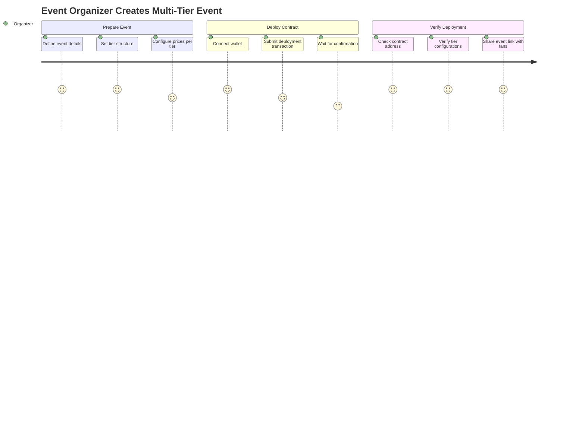

### 2. Withdraw Revenue

**Story**: As an organizer, I can withdraw collected ERC-20 tokens from the contract

- Withdrawal only allowed when <12 hours remain before event (after refund deadline)
- Can withdraw any amount up to contract balance
- Before deadline, withdrawal transactions are rejected by smart contract

_Proves: Time-locked fund access, organizer protections_

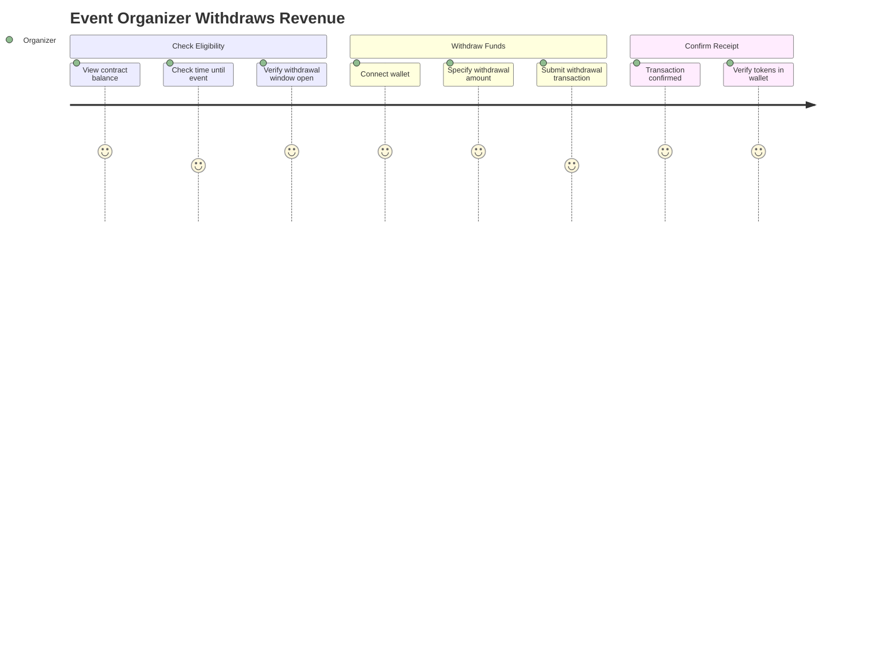

## Fans - Purchase Flow Case Stories (Must-Have)

### 3. Preview Event & Availability

**Story**: As a fan, I can view an event's:

- Tier information (names, prices in ERC-20 tokens)
- Tickets remaining per tier in real-time
- Event date/timestamp
- Refund deadline (12 hours before event)

_Proves: Transparent availability, no hidden inventory_

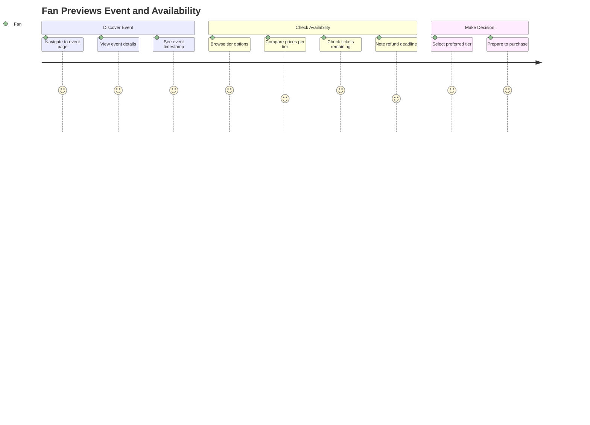

### 4. Purchase Ticket with ERC-20

**Story**: As a fan, I can buy a ticket from a specific tier using ERC-20 tokens

- **NFT is minted at purchase time and transferred to my wallet**
- Payment (ERC-20 transfer) and ticket delivery (NFT mint + transfer) are atomic
- Either both happen or neither happens
- Tier's available count decrements

_Proves: Atomic lazy minting with ERC-20 payment_

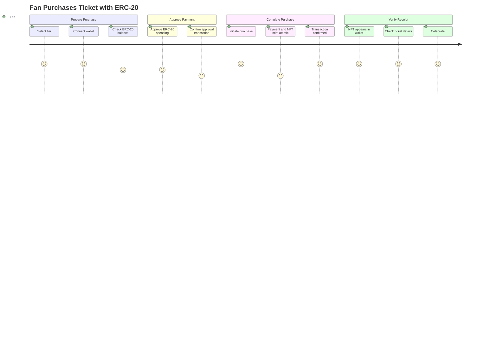

### 5. Resilient Purchase with Auto-Retry

**Story**: As a fan, if my purchase fails due to network/consensus issues:

- System automatically retries up to 3 times
- Only reports error to me after all 3 attempts fail

_Proves: Fault tolerance for real-world blockchain conditions_

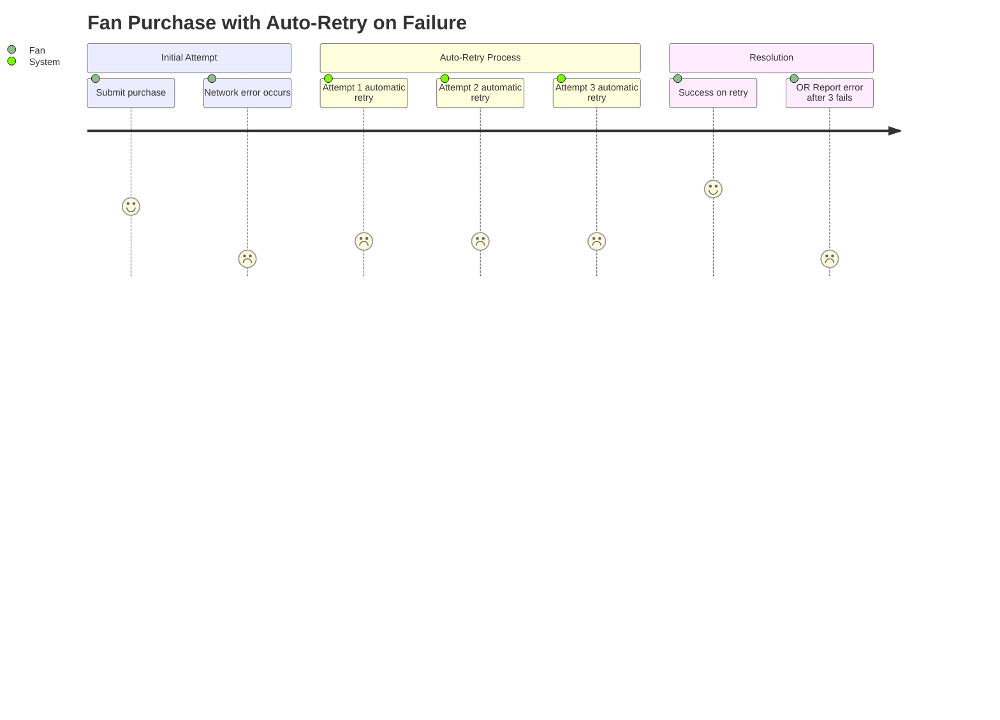

### 6. Ticket Refund (Time-Bound)

**Story**: As a fan, I can return my ticket and receive full ERC-20 refund

- Only allowed if >12 hours remain before event timestamp
- After deadline, refunds are rejected by smart contract
- **NFT is burned on refund**
- Returned ticket slot goes back into available pool for that tier
- ERC-20 tokens transferred back from contract to my wallet

_Proves: Smart contract time enforcement, NFT burn, refund logic_

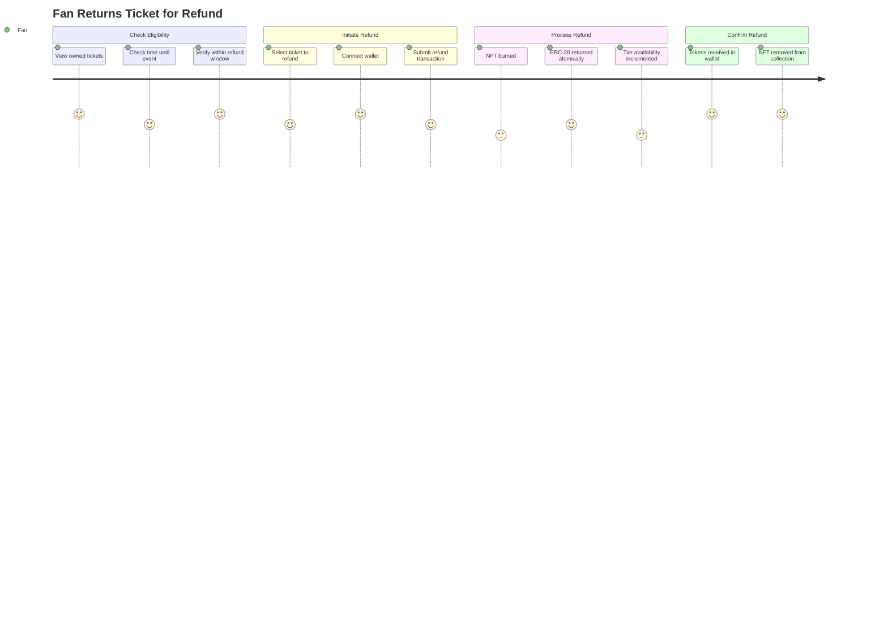

### 7. No Duplicate Sales

**Story**: As a fan, once a ticket is purchased, that specific tier slot is marked sold

- Each tier tracks sold count vs. capacity
- Cannot exceed tier capacity

_Proves: Built-in scarcity via blockchain_

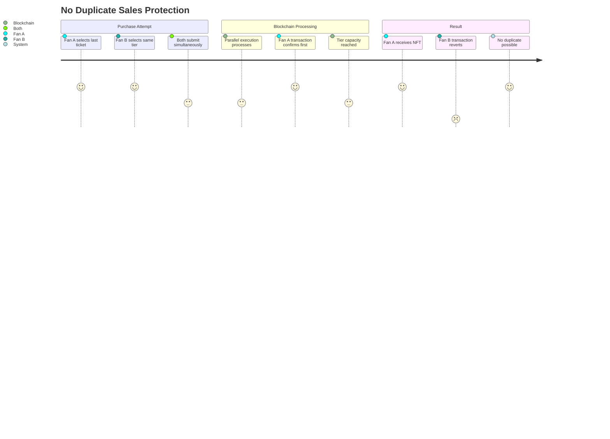

## Demo Viewer Stories Case Stories (Must-Have)

### 8. Parallel Purchase Simulation

**Story**: As a demo viewer, I can see multiple simulated users buying from different tiers simultaneously

- System handles concurrent requests across tiers without crashes
- Real-time update of remaining tickets per tier
- NFTs minted on-the-fly for each purchase

_Proves: Parallel execution handling high demand with lazy minting_

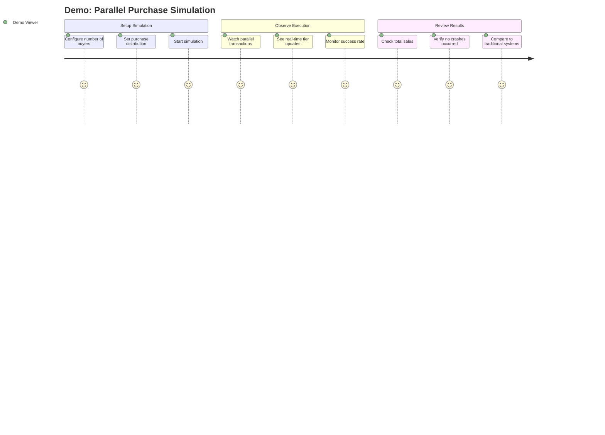

## Nice-to-Have (If Time Permits)

### 9. Ticket Transfer

**Story**: As a ticket holder, I can transfer my ticket NFT to another wallet

_Proves: Secondary market capability_

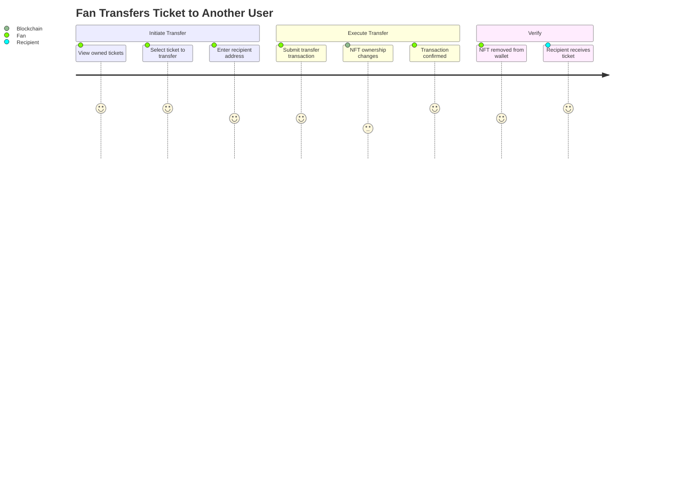

### 10. Event Listing/Discovery

**Story**: As a fan, I can browse multiple deployed event contracts

- Filter by date, availability, price range

_Proves: Multi-event marketplace basics_

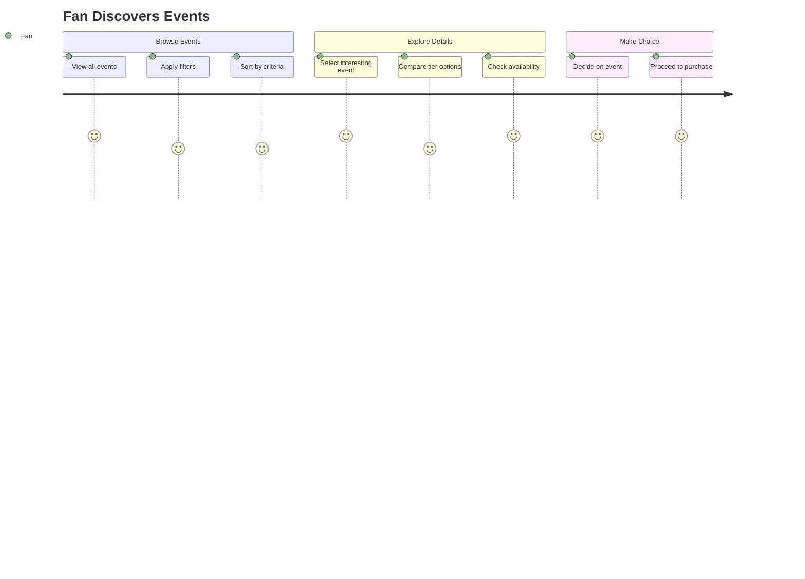

### 11. Organizer Dashboard

**Story**: As an organizer, I can view:

- Total sales per tier
- Total ERC-20 collected
- Amount available for withdrawal (after deadline)

_Proves: Business analytics_

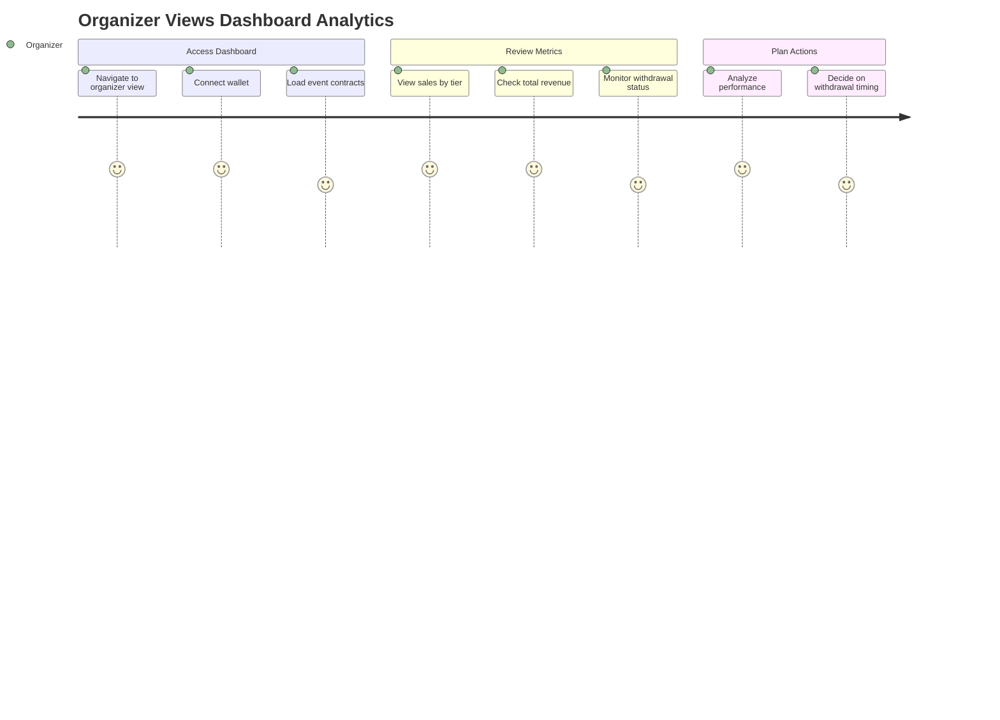

### 12. Partial Withdrawals

**Story**: As an organizer, I can withdraw funds incrementally after deadline

- Track total withdrawn vs. available

_Proves: Flexible fund management_

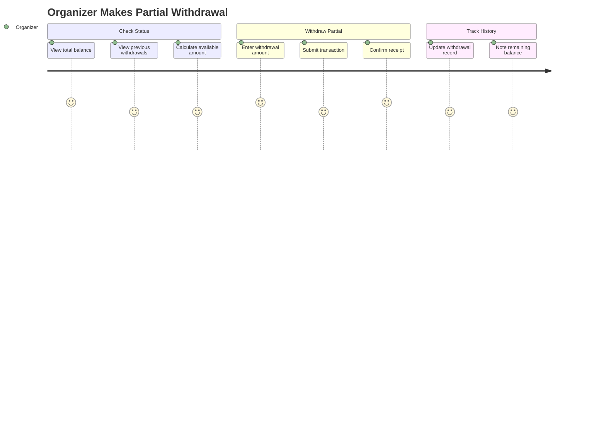
